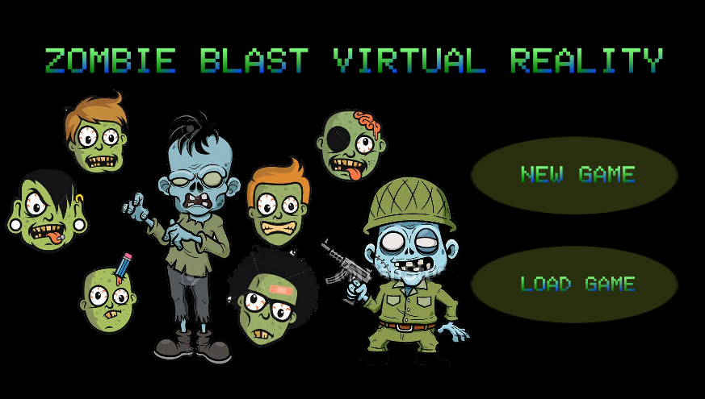

# Zombie Blast VR 🧟‍♂️🧟‍♀️

In this project with Virtual Reality, I created a zombie shooter game that simulates users' physical presence in a computer-generated environment. VR gaming systems aim to let users believe they inhabit a virtual world. VR gaming systems simulate a virtual world where players can interact with virtual items and features.

</img> 

## Language
The project is written in C#.

## Tools
Unity Engin, Google VR.

## Images
Will be uploaded soon
<!-- </img> 
</img> 
</img>  -->

## Contributing
Pull requests are welcome. For major changes, please open an issue first to discuss what you would like to change.

Please make sure to update tests as appropriate.

## License
[ Apache-2.0 License](http://www.apache.org/licenses/)
